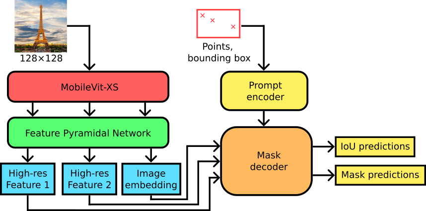

# UltraTinySAM: Real-time Image Segmentation with Sony IMX500

## Abstract

Deploying high-quality, general-purpose segmentation models on edge devices remains a challenging task, primarily due to the significant memory and compute demands associated with such architectures. This is particularly the case for recent transformer-based models like SAM (Segment-Anything Model), whose size and complexity make them unsuitable for deployment on ultra-constrained platforms such as the Sony IMX500. 

**UltraTinySAM** addresses this challenge by introducing a compact variant of SAM specifically optimized for deployment on the Sony IMX500 edge-AI vision sensor. The proposed design leverages a MobileViT-XS encoder in combination with a lightweight SAM2 mask decoder, enabling the entire model to fit and execute within the IMX500’s 8 MB on-chip memory and supported operations. This allows interactive segmentation at 128×128 resolution with latency under 13 ms, while maintaining competitive segmentation accuracy, particularly in scenarios involving simple prompts (e.g., a small number of points). This work enables real-time in-sensor semantic understanding for power-constrained applications, and explores the potential of deploying transformer-based architectures directly on the IMX500 edge-AI platform.

---

<p align="center">
  
</p>

<p align="center">
  
</p>

---

## 🧠 Results

### Comparison with SAM-variants

| Model             | Fit on IMX500 | Parameters (M) | MACs (G) | Native Resolution | Encoder size ratio (vs SAM ViT-B) |
|------------------|:-------------:|----------------|----------|-------------------|-----------------------------------|
| SAM ViT-H        | ❌            | 641.1          | 2984     | 1024×1024         | 711%                              |
| SAM ViT-L        | ❌            | 312.3          | 1496     | 1024×1024         | 344%                              |
| SAM ViT-B        | ❌            | 93.73          | 488.2    | 1024×1024         | 100%                              |
| EfficientSAM-S   | ❌            | 26.41          | 247.7    | 1024×1024         | 24.7%                             |
| EfficientSAM-Ti  | ❌            | 10.22          | 104.2    | 1024×1024         | 6.7%                              |
| MobileSAM        | ❌            | 10.13          | 40.97    | 1024×1024         | 6.6%                              |
| TinySAM          | ❌            | 10.13          | 40.97    | 1024×1024         | 6.6%                              |
| **UltraTinySAM** | ✅            | **5.60**       | **0.31** | **128×128**       | **1.5%**                          |

### mAP (%) on COCO and LVIS Across Prompt Types

| Model             | 1 click | 3 clicks | 5 clicks | Bounding Boxes | 1 click | 3 clicks | 5 clicks | Bounding Boxes |
|------------------|--------:|---------:|---------:|----------------:|--------:|---------:|---------:|----------------:|
|                  | **COCO**                              | **LVIS**                             |
| SAM ViT-H        | 14.49   | 20.56    | 22.84    | 28.59          | 12.69   | 18.89    | 20.98    | 25.83           |
| SAM ViT-L        | 13.23   | 18.60    | 21.16    | 27.72          | 13.07   | 16.82    | 16.12    | 25.49           |
| SAM ViT-B        | 11.40   | 16.51    | 20.61    | 26.30          | 11.72   | 15.33    | 17.45    | 23.41           |
| EfficientSAM-S   | 13.60   | 21.12    | 26.55    | 29.67          | 13.37   | 18.19    | 22.85    | 25.86           |
| EfficientSAM-Ti  | 13.23   | 18.60    | 21.16    | 27.72          | 12.72   | 19.96    | 21.92    | 24.38           |
| MobileSAM        | 13.04   | 18.29    | 20.88    | 26.16          | 11.93   | 15.33    | 14.03    | 23.35           |
| TinySAM          | 9.70    | 17.19    | 21.00    | 27.42          | 10.71   | 17.44    | 17.85    | 23.41           |
| **UltraTinySAM** | **10.53** | **12.54** | **13.42** | **13.27**    | **7.20** | **9.67** | **9.50** | **12.51**       |
| + PTQ            | 8.93    | 10.84    | 9.38     | 10.84          | 6.34    | 7.11     | 6.59     | 9.57            |
| + QAT            | 10.07   | 10.97    | 9.35     | 11.92          | 5.55    | 5.43     | 4.73     | 9.58            |

---

## 🔧 Fine-Tuning for Custom Tasks

UltraTinySAM can be **fine-tuned on specific datasets** to significantly improve its performance for targeted tasks or domains.

Here are example results on the **CamVid** dataset:

### Finetuned UltraTinySAM, mAP (%) on CamVid Test Set

| Model                  | 1 click | 3 clicks | 5 clicks | Bounding Boxes |
|------------------------|--------:|---------:|---------:|----------------:|
| EfficientSAM-Ti        | 16.74   | 20.06    | 22.62    | 21.91           |
| UltraTinySAM (original)| 14.80   | 16.73    | 17.34    | 13.31           |
| **UltraTinySAM (finetuned)** | **25.90** | **25.41** | **25.07** | **18.07**       |

To fine-tune on your own dataset:

1. Modify the config file:
   - Path: `sam2_modified/configs/ultratinysam_training/FINETUNING.yaml`
   - Adjust dataset path, class labels, and training parameters.

2. Launch training:

```bash
python train.py -c configs/ultratinysam_training/FINETUNING.yaml --num-gpus 1
```

---

## 🚀 Usage

### 1. Install Environment

```bash
conda env create --name UltraTinySAM --file=environment.yaml
```

### 2. Patch Libraries

After installing the environment, you need to patch the python libraries to install UltraTinySAM:

```bash
rm -r ~/miniconda3/envs/UltraTinySAM/lib/python3.11/site-packages/sam2 && cp -r sam2_modified ~/miniconda3/envs/UltraTinySAM/lib/python3.11/site-packages/sam2

rm -r ~/miniconda3/envs/UltraTinySAM/lib/python3.11/site-packages/training && cp -r training_modified ~/miniconda3/envs/UltraTinySAM/lib/python3.11/site-packages/training

rm -r ~/miniconda3/envs/UltraTinySAM/lib/python3.11/site-packages/model_compression_toolkit && cp -r model_compression_toolkit_modified ~/miniconda3/envs/UltraTinySAM/lib/python3.11/site-packages/model_compression_toolkit
```

---

## 📦 Export Examples

### For Evaluation

```bash
python export_utsam.py --config configs/ultratinysam/UltraTinySAM.yaml --model_checkpoint checkpoints/utsam.pt --export_fp --static_labels --labels_mode 1-click
```

### For Deployment

```bash
python export_utsam.py --config configs/ultratinysam/UltraTinySAM.yaml --model_checkpoint checkpoints/utsam.pt --export_quant --static_point --labels_mode 1-click
```

A ready to deploy exported ONNX is available in the repo.

---

## 📊 Evaluation

To download and preprocess the subset of the SA-1B dataset we used for training:

### Preprocess

```bash
python preprocess_dataset.py
```

- Resizes and filters masks (default: `min_area=150`)

### Generate Annotations

```bash
python create_dataset_annotations.py
```

- Lists all training/val image/mask pairs for training use.

---

## 🧪 Training

To train UltraTinySAM from scratch or fine-tune:

```bash
python train.py -c configs/ultratinysam_training/FULL_TRAINING.yaml --num-gpus 1
```

---

## ⚙️ IMX500 Deployment Conversion

Convert the quantized ONNX model to IMX500-compatible binary:

```bash
imxconv-pt -i ptq-ultra-tiny-sam-static.onnx -o exported_model
```

And have a look at https://www.raspberrypi.com/documentation/accessories/ai-camera.html.

---

## 📎 License

This project is licensed under the MIT License. See the [LICENSE](LICENSE) file for details.

## 📜 Citation

If you use this code or model in your research, please cite our work.

## Acknowledgments

This work builds upon the Segment Anything Model (SAM) and its brother SAM2, as well as the MobileViT-XS architecture. We thank the authors for these amazing works.
Specifically,the code in this repository is build on top of the SAM2 implementation: https://github.com/facebookresearch/sam2. 